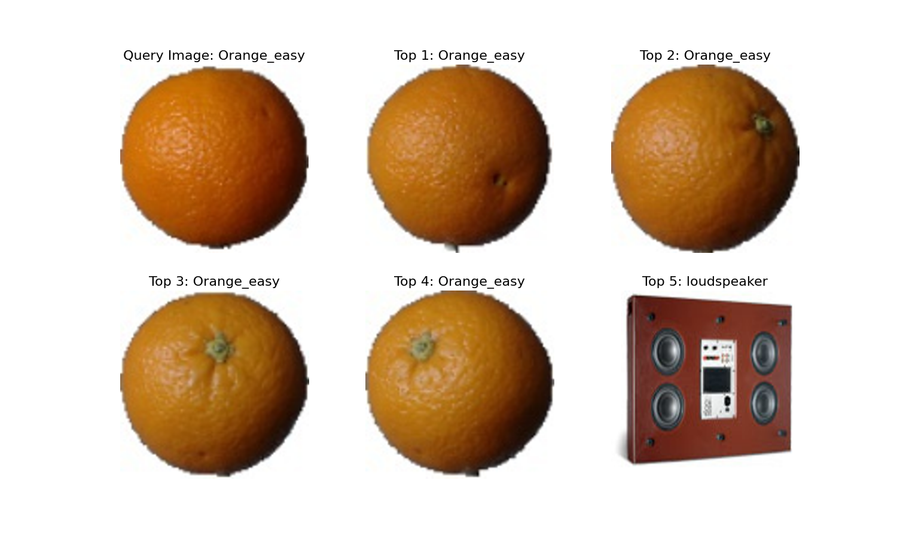
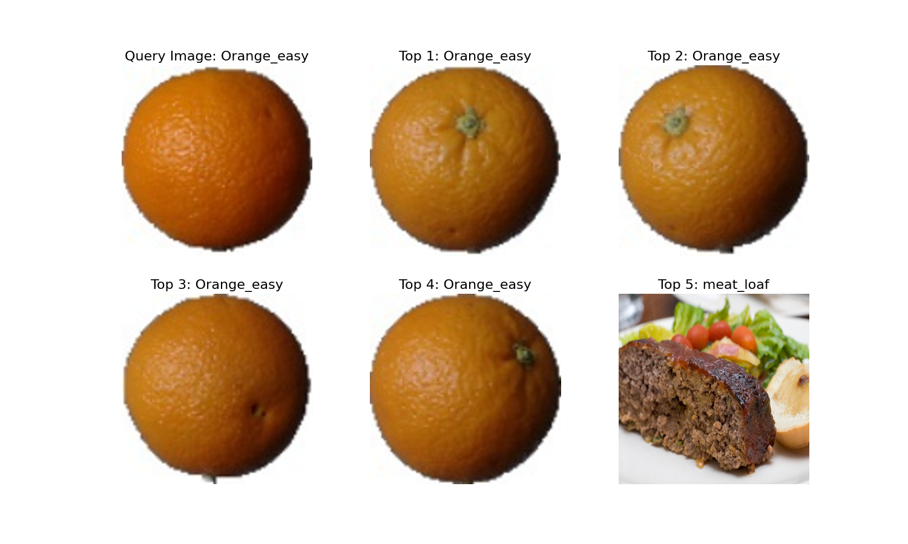
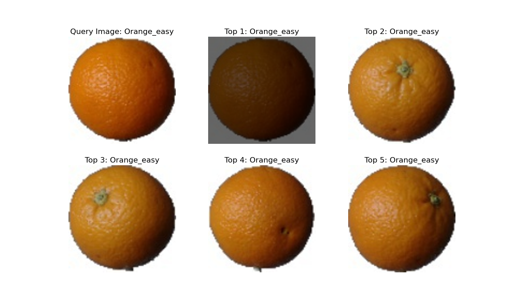

# Image Retrieval System
This project provides a comprehensive approach to building an image retrieval system using both basic image similarity measures and advanced deep learning techniques.

# Table of Contents
- [Introduction](#introduction)
- [Features](#features)
- [Installation](#installation)
- [Basic Image Retrieval](#basic-image-retrieval)
- [Advanced Image Retrieval](#advanced-image-retrieval)
- [Web Crawling](#web-crawling)

## Introduction
Image Retrieval is a critical task in Information Retrieval, where the goal is to retrieve relevant images from a dataset based on a query image. Applications of image retrieval include search engines like Google Images and product search features on e-commerce platforms like Amazon and Shopee.

This project offers both basic and advanced implementations of an image retrieval system. The basic system utilizes traditional similarity measures, while the advanced system leverages a pretrained deep learning model (CLIP) for feature extraction and a vector database for efficient retrieval. Additionally, a web crawling component is included to expand the dataset by scraping images from the web.

## Features
- **Basic Image Retrieval**:
    - Measures: L1 (Manhanttan Distance), L2 (Euclidean Distance), Cosine Similarity, and Correlation Coefficient.
    - Image similarity calculation and retrieval based on various metrics.
- **Advanced Image Retrieval**:
    - Pretrained deep learning model (CLIP) for feature extraction.
    - Vector database for storing and querying image features.
    - Enhanced retrieval accuracy by leveraging deep learning.
- **Web Crawling**

## Installation
To run this project locally, follow these steps:
1. Clone the repository:
```bash
git clone https://github.com/toan-ly/Image-Retrieval.git
cd Image-Retrieval
```

2. Install Dependencies:
Ensure you have Python 3.7+ installed. Then, install the required libraries:
```bash
pip install numpy matplotlib Pillow chromadb open-clip-torch
```

## Basic Image Retrieval
1. Run the Basic Retrieval:
```python
python main.py
```
This script allows you to retrieve similar images from the dataset based on the traditional similarity measures (L1, L2, Cosine Similarity, Correlation Coefficient).

2. Examples:
- **L1 Distance**:

- **L2 Distance**:

- **Cosine Similarity**:

- **Correlation Coefficient**:


## Advanced Image Retrieval
1. Run the Advaned Retrieval:
```bash
cd notebooks
```
The codes are included in ```run_retrieval_embedding.ipynb``` and ```optimized_retrieval_vector_database.ipynb```, utilizing the pretrained CLIP model to extract features and stores them in a vector database for efficient retrieval.

## Web Crawling
The codes are in ```crawler.ipynb``` and ```crawler_preprocessing.ipynb```, which crawl the web based on the configuration and download images to the specified folder.
